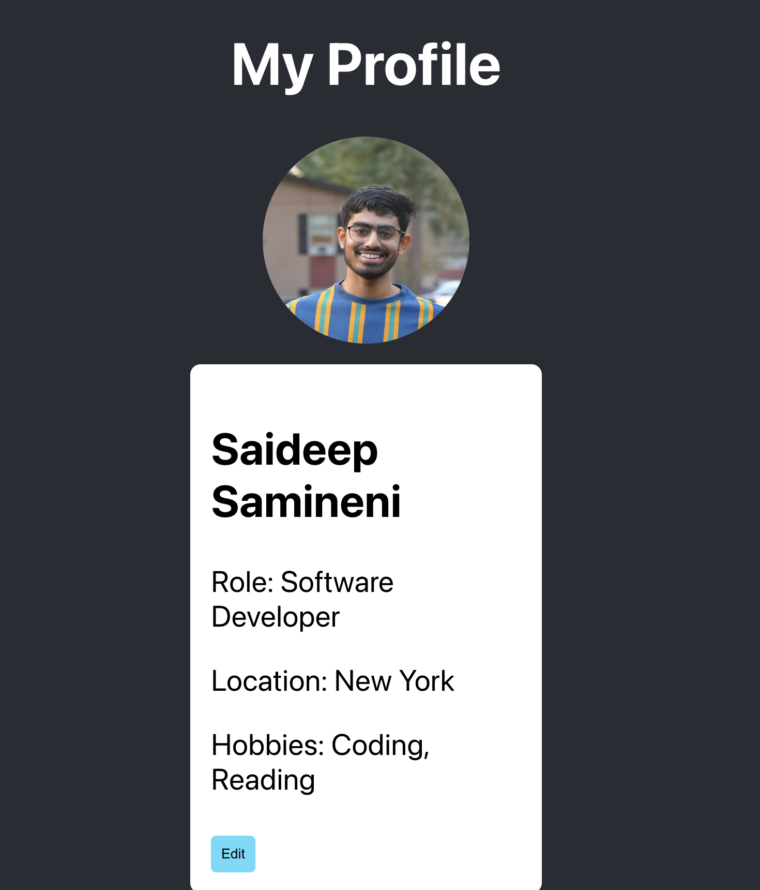
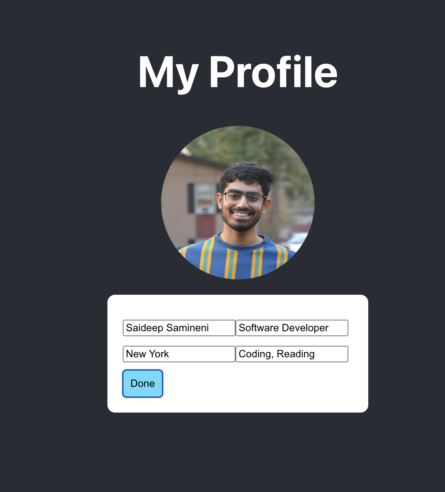

# Applicant Information System

This project is a simple web application built with Node.js, Express, PostgreSQL, and React. The application allows users to click on a picture and fetch applicant information from a backend API from the Postgresql DB. The information can be edited and updated back to the backend. The project is thoroughly tested using Jest for both frontend and backend, ensuring high reliability and correctness.

This is made part of **Vivacity Tech PBC exercise**.






## Project Demo

<div align="center">
  <iframe width="560" height="315" src="https://www.youtube.com/embed/59LwPrZfCvo" frameborder="0" allow="accelerometer; autoplay; encrypted-media; gyroscope; picture-in-picture" allowfullscreen></iframe>
</div>

## Table of Contents

- [Prerequisites](#prerequisites)
- [Project Setup](#project-setup)
- [Running the Application](#running-the-application)
- [Running Tests](#running-tests)
- [Project Structure](#project-structure)
- [API Endpoints](#api-endpoints)

## Prerequisites

Make sure you have the following installed on your machine:

- Node.js (v14 or later)
- PostgreSQL (v12 or later)
- npm (Node Package Manager)

## Project Setup

### Backend Setup

1. Clone the repository:

    ```bash
    git clone https://github.com/saideep2000/Vivacity-Tech-Exercise.git
    cd Vivacity-Tech-Exercise/backend
    ```

2. Install the dependencies:

    ```bash
    npm install
    ```

3. Create a `.env` file in the `backend` directory and add the following environment variables:

    ```env
    PORT=4000
    DB_USER=your_db_user
    DB_HOST=localhost
    DB_NAME=your_db_name
    DB_PASS=your_db_password
    DB_PORT=5432
    ```

4. Set up the PostgreSQL database:

    ```sql
    CREATE DATABASE your_db_name;
    \connect your_db_name;
    CREATE TABLE applicants (
        id SERIAL PRIMARY KEY,
        name VARCHAR(255) NOT NULL,
        role VARCHAR(255),
        location VARCHAR(255),
        hobbies TEXT[],
        tag VARCHAR(255)
    );
    ```

### Frontend Setup

1. Navigate to the `frontend` directory:

    ```bash
    cd ../frontend/
    ```

2. Install the dependencies:

    ```bash
    npm install
    ```

## Running the Application

### Backend

1. Start the backend server:

    ```bash
    npm run dev
    ```

    The backend server will be running at `http://localhost:4000`.

### Frontend

1. Start the frontend application:

    ```bash
    npm start
    ```

    The frontend application will be running at `http://localhost:3000`.

## Running Tests

To run the tests, use the following command in the `backend` directory:

```bash
npm test
```


## All the backend commands that I've used:
```bash
To start :
npm init -y

Install :

npm install typescript express cors
npm install --save-dev @types/node @types/express @types/cors

npx tsc --init

npm install dotenv

npm install pg

npm install joi

npm install --save-dev @types/joi

npm install --save-dev supertest

npm install --save-dev @types/supertest

npm install --save-dev jest

npm install --save-dev @types/jest

npm install --save-dev @types/node


Installing postgres:

brew install postgresql

automatically starting services:
brew services start postgresql

Manually controlling:
pg_ctl -D /usr/local/var/postgres start
pg_ctl -D /usr/local/var/postgres stop

Login to postgres:
psql postgres
CREATE ROLE app_user WITH LOGIN PASSWORD 'app_password';
ALTER ROLE app_user CREATEDB;
\du
To exit : ctrl + D

psql postgres -U app_user
CREATE DATABASE app_database;
\l
\connect app_database;
\dl
CREATE TABLE applicants (
    id SERIAL PRIMARY KEY,
    name VARCHAR(255) NOT NULL,
    role VARCHAR(255),
    location VARCHAR(255),
    hobbies TEXT[]
);
\d applicants

INSERT INTO applicants (name, role, location, hobbies) VALUES
('Saideep Samineni', 'Software Developer', 'New York', '{"Coding", "Reading"}');

SELECT * FROM applicants;

SELECT * FROM applicants WHERE name = 'Saideep Samineni';

```

-------------------------------------------------------------------------------

## All the backend commands that I've used:
```bash

npx create-react-app . --template typescript

npm install axios

npm install @reduxjs/toolkit react-redux @types/react-redux axios

npm install --save-dev ts-jest @types/jest jest

npm install --save-dev jest ts-jest @types/jest jest-environment-jsdom

npm install --save-dev @testing-library/jest-dom


```